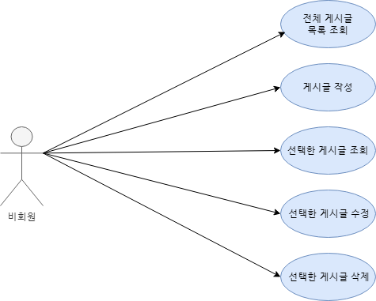

# README

## 💡 Introduce

> 22.12.05 ~ 22.12.07

Spring으로 로그인 없는 블로그를 구현합니다.

* 전체 게시글 목록 조회
* 게시글 작성
* 선택한 게시글 조회, 수정, 삭제

 

## ⚙ Tool

    
    
    
    

 

## 📌 Usecase

 

## 📃 API 명세

| 기능                  | Method | URL            | Request                                                      | Response                                                     |
| :-------------------- | :----- | :------------- | :----------------------------------------------------------- | :----------------------------------------------------------- |
| 전체 게시글 목록 조회 | GET    | /api/posts     | -                                                            | {  {  "createdAt": "2022-07-25T12:43:01.226062”,  "modifiedAt": "2022-07-25T12:43:01.226062”,  "id": 1, "title": "title2", "content": "content2",  "author": "author2"  },  {  "createdAt": "2022-07-25T12:43:01.226062”,  "modifiedAt": "2022-07-25T12:43:01.226062”,  "id": 2,  "title": "title",  "content": "content",  "author": "author"  },  …  } |
| 선택한 게시글 조회    | GET    | /api/post/{id} | -                                                            | {  "createdAt": "2022-07-25T12:43:01.226062”,  "modifiedAt": "2022-07-25T12:43:01.226062”,  "id": 1,  "title": "title2",  "content": "content2",  "author": "author2"  } |
| 게시글 작성           | POST   | /api/post      | { "title" : "title",  "content" : "content",  "author" : "author",  "password" : "password" } | {  "createdAt": "2022-07-25T12:43:01.226062”,  "modifiedAt": "2022-07-25T12:43:01.226062”,  "id": 1,  "title": "title",  "content": "content",  "author": "author"  } |
| 선택한 게시글 수정    | PUT    | /api/post/{id} | { "title" : "newtitle",  "content" : "newcontent",  "author" : "author",  "password" : "newpassword" } | {  "createdAt": "2022-07-25T12:43:01.226062”,  "modifiedAt": "2022-07-25T12:43:01.226062”,  "id": 1,  "title": "title2",  "content": "content2",  "author": "author2"  } |
| 선택한 게시글 삭제    | DELETE | /api/post/{id} | {  "password" :"password"  }                         | {  "success": true,  }                               |

 

## 🔍 Method

| 기능               | Controller, Service    | (+)                       |
| ------------------ | ---------------------- | ------------------------- |
| 전체 게시글 조회   | getPosts()             | 비밀번호 제외한 정보 표시 |
| 게시글 작성        | createPost()           | -                         |
| 선택한 게시글 조회 | getPost()              | 비밀번호 제외한 정보 표시 |
| 선택한 게시글 수정 | updatePost(), update() | 비밀번호 확인 후 실행     |
| 선택한 게시글 삭제 | deletePost()           | 비밀번호 확인 후 실행     |

 

## 📝 Answer a question

​	**A1. 수정, 삭제 API의 request를 어떤 방식으로 사용하셨나요? (param, query, body)**

​	=> body 사용 / query와 param을 사용 시, 주소에 변수값과 변수로 password가 들어갔을 때 보안상 안 좋을 것 같다는 생각으로 body를 썼습니다.

​	**A2. 어떤 상황에 어떤 방식의 request를 써야하나요?** 

​	=> param : 하나의 데이터에 대한 정보를 받아올 때, 데이터를 식별할 때

​	=> query : 여러 개의 데이터를 넘길 때, 정렬이나 필터링으로 원하는 조건의 데이터를 받아올 때

​	=> body : JSON 등의 데이터를 담을 때

​	**A3. RESTful한 API를 설계했나요? 어떤 부분이 그런가요? 어떤 부분이 그렇지 않나요?**

​	=> 각 기능에 대해 적절한 API Method를 선택하고 annotation을 통해 해당 HTTP 요청이 왔을 때만 동작하도록 RESTful하게 구현했습니다.

​	**A4. 적절한 관심사 분리를 적용하였나요? (Controller, Repository, Service)**

​	=> 사용자의 요청을 받는 곳은 Controller, 실질적인 처리를 하는 곳은 Service, DB에 접근하는 메서드는 Repository로 분리했습니다.

​	**A5. API 명세서 작성 가이드라인을 검색하여 직접 작성한 API 명세서와 비교해보세요!**

​	=> statusCode를 추가하고 request의 query string과 body 부분을 나눠서 작성했다면 더 좋았을 것 같다.
